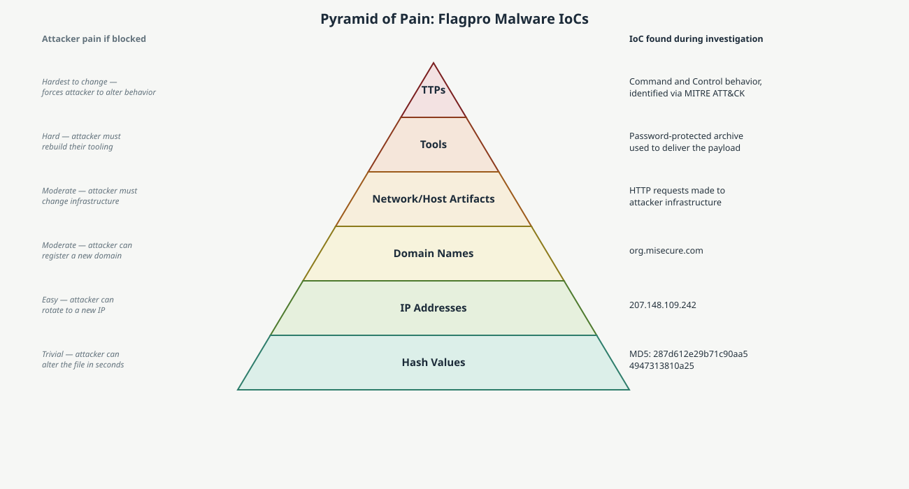

# Malware Analysis with VirusTotal and the Pyramid of Pain

## Project Description

This project investigates a suspicious file hash using VirusTotal, determines whether the file is malicious, and maps the resulting indicators of compromise (IoCs) onto the Pyramid of Pain framework. The Pyramid of Pain ranks IoCs by how much difficulty a given indicator causes an attacker when defenders detect and block it, from trivial (a file hash) to severe (a change in tactics, techniques, and procedures). This reflects the triage work a level one SOC analyst performs when responding to an endpoint alert.

## Scenario

A financial services company's intrusion detection system alerts on multiple unauthorized executable files appearing on an employee's computer. Investigation traces the cause back to a phishing email: the employee received a password-protected spreadsheet attachment, with the password included in the same email, and opening it after entering the password executed a malicious payload. The file was retrieved and hashed for analysis.

**SHA256:** `54e6ea47eb04634d3e87fd7787e2136ccfbcc80ade34f246a12cf93bab527f6b`

**Timeline:**

| Time | Event |
|---|---|
| 1:11 PM | Employee receives an email with a file attachment |
| 1:13 PM | Employee downloads and opens the file |
| 1:15 PM | Multiple unauthorized executable files are created on the employee's computer |
| 1:20 PM | Intrusion detection system alerts the SOC |

## Is the file malicious?

Yes. Querying the SHA256 hash on VirusTotal returns a high vendor detection ratio, the majority of scanning engines flag it as malicious, corroborated by a negative community score and detailed malware-family identification in the Detection tab. The file is identified as **Flagpro**, a malware family publicly associated with **BlackTech**, an advanced persistent threat (APT) group known for targeting organizations across East Asia and Japan-linked supply chains using exactly this kind of password-protected attachment delivery method. A single high vendor ratio alone wouldn't be conclusive, but the combination of vendor consensus, community sentiment, and a named malware family tied to a known threat actor is a consistent picture, which is what actually justifies the malicious determination rather than any one metric in isolation.

## Pyramid of Pain

| Level | Indicator found | Why it sits at this level |
|---|---|---|
| Hash values | MD5 `287d612e29b71c90aa54947313810a25` (alternate hash for the same file, found in the Details tab) | Trivial for an attacker to defeat: changing a single byte of the file produces a completely different hash, so blocking on hash alone only stops this exact file, not the next variant |
| IP addresses | `207.148.109.242`, an address the malware contacted, found under Relations | Cheap for an attacker to rotate; blocking one IP just pushes them to spin up another host |
| Domain names | `org.misecure.com`, flagged as malicious under Relations | Costs the attacker a bit more, registering and reputation-building a new domain takes real effort, but it's still replaceable |
| Network/host artifacts | Outbound HTTP requests to attacker-controlled infrastructure, observed in the sandbox report under Behavior | Reflects how the malware communicates, not just where; forces the attacker to change their delivery or C2 mechanism, not just an address |
| Tools | Use of a password-protected archive as a delivery mechanism to evade attachment scanning | Denying this technique means the attacker has to find or build a different delivery tool entirely |
| TTPs | Command and Control behavior, identified against the MITRE ATT&CK framework in the sandbox report | The hardest indicator to defend against by removal, since it describes the attacker's actual behavior pattern; disrupting this forces a fundamental change in how the group operates, not just what infrastructure they use |

## Why the pyramid matters for prioritization

The value of the Pyramid of Pain isn't just categorizing IoCs, it's deciding where to spend limited detection engineering effort. Blocking the hash and the IP address is fast and easy, but a motivated actor like BlackTech will simply rotate both within hours. Building a detection around the TTP, in this case the specific Command and Control behavior pattern, is more work up front but catches the next Flagpro variant even after every hash, IP, and domain in this report has changed.

## Summary

This investigation confirmed a Flagpro malware infection tied to the BlackTech threat actor using VirusTotal's vendor detections, community score, and sandbox behavior report, then mapped six associated IoCs across every level of the Pyramid of Pain, from a trivially-changed hash value up to the attacker's underlying command-and-control behavior. The exercise reflects a core SOC analyst skill: not just confirming that a file is malicious, but understanding which of the resulting indicators are worth building lasting detections around.
